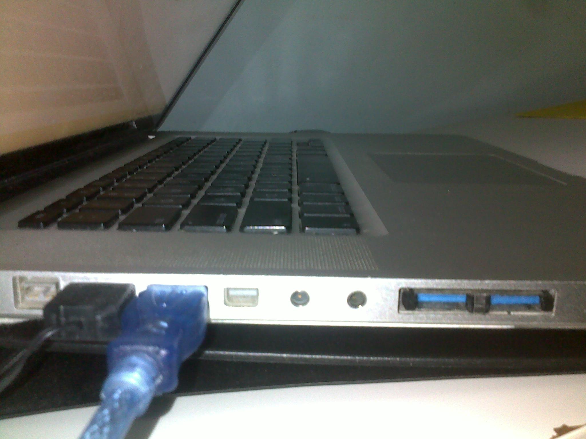

Notice how the original USB ports are blocked. You can add additionally USB ports with an ExpressCard USB. You can get one cheaply on eBay or Amazon at around $10.

My MacBook Pro (late 2008) does not readily support the ExpressCard. You have to download 3rd party drivers.

**Requirements:**

1. Get an Expresscard USB that has a `uPD720202` Chipset
2. <a href="http://sourceforge.net/projects/genericusbxhci/files/latest/download" target="_blank">Download</a> the driver by zenith432 
3. <a href="http://cvad-mac.narod.ru/index/0-4" target="_blank">Download</a> Kext Utility
4. Install the driver using Kext Utility and restart

**Some Problems:**

1. Most USB devices will work, a mouse and USB external drive have failed so far.
2. The Expresscard USB may get stuck in the MacBook Pro.

To remove the Expresscard menubar icon, go to "/System/Library/CoreServices/Menu Extras" and rename "ExpressCard.menu". Restart again.

More help/info can be found at <a href="http://www.insanelymac.com/forum/topic/286860-genericusbxhci-usb-30-driver-for-os-x-with-source" target="_blank">insanelymac.com</a> 